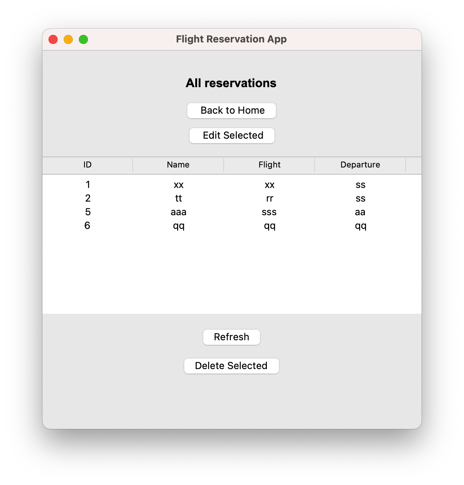
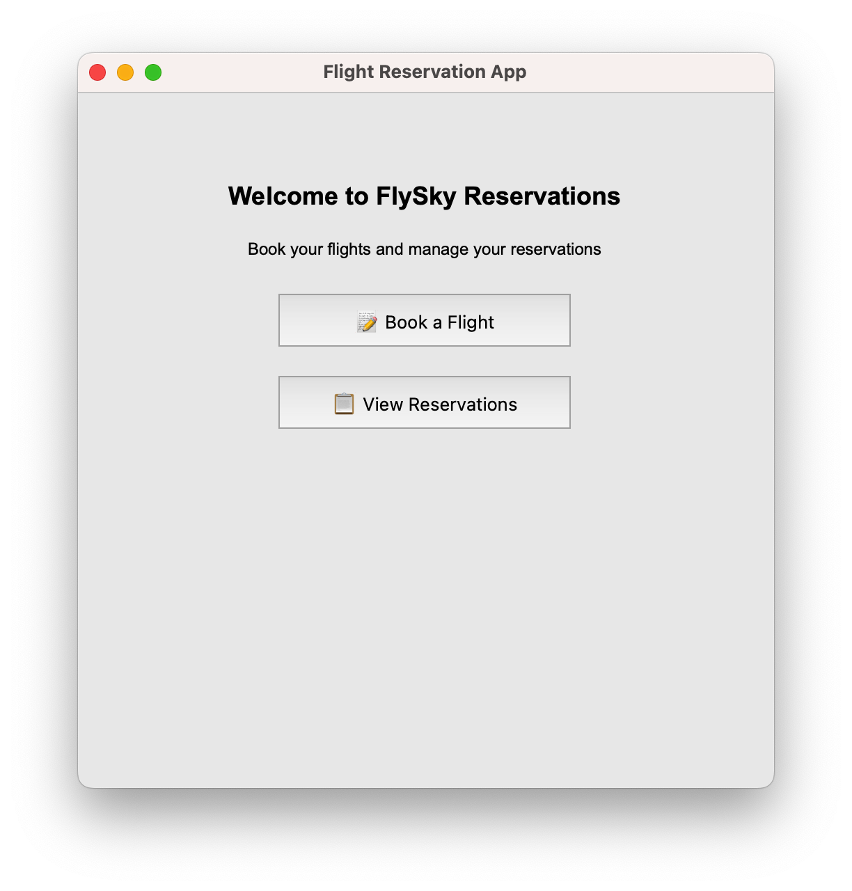
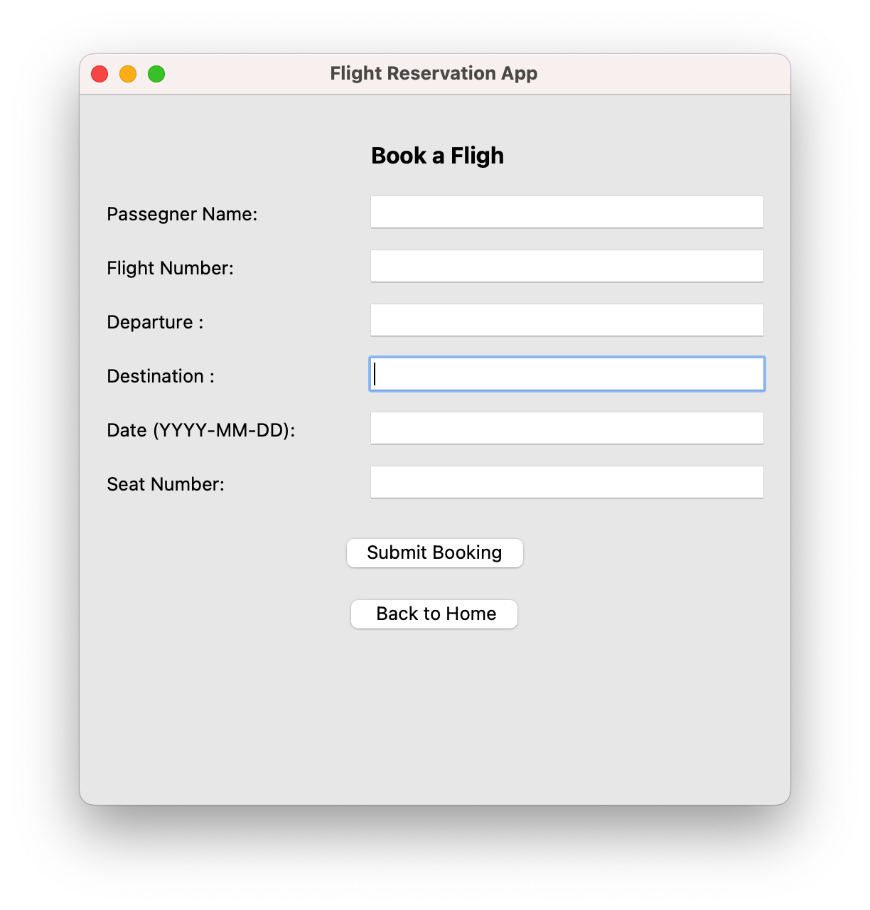

# ✈️ Flight Reservation App

A simple yet powerful desktop application built with **Python** and **Tkinter** to manage flight reservations.

This app allows users to:
- 📝 Book a flight
- 📋 View all reservations
- ✏️ Edit existing reservations
- 🗑️ Delete reservations
- 💾 Save everything in a local SQLite database

---

## 📸 Interface Preview

> Simple and intuitive UI using `tkinter`.




---


## 🚀 How to Run

### ▶️ Requirements
Make sure you have Python 3 installed.

### 🧪 Run the app:

```bash
python main.py
````

> The app will open in a window where you can manage all flight reservations easily.

---

## 🗂️ Project Structure

```bash
flight-reservation-app/
├── main.py                  # Main entry point
├── home.py                  # Home screen UI
├── booking.py               # Booking logic
├── reservations.py          # View/Edit/Delete reservations
├── edit.py                  # Edit reservation window
├── database.py              # SQLite database connection & setup
├── flights.db               # (auto-generated) database file
├── icon.ico                 # App icon (optional)
└── README.md                # Project documentation
```

---

## 🧾 Database

The app uses **SQLite** to store reservations locally.
The table created is called `flight` and stores:

* ID
* Passenger Name
* Flight Number
* Departure
* Destination
* Date
* Seat Number

You don’t need to create the table manually — it’s auto-created if it doesn't exist.

---

## 📦 Packaging

You can turn this project into a `.exe` using **PyInstaller**:

```bash
pyinstaller --onefile  main.py
```

---

## 📄 License

This project is open-source and free to use.
Feel free to modify, improve or include it in your portfolio ⭐

---

## 💬 Author

Made by **Abdulrahman Mangoud**

[GitHub](https://github.com/mangoud2005) | [LinkedIn](www.linkedin.com/in/abdulrahman-mangoud-408ab21a5)


# flight-reservation-app
